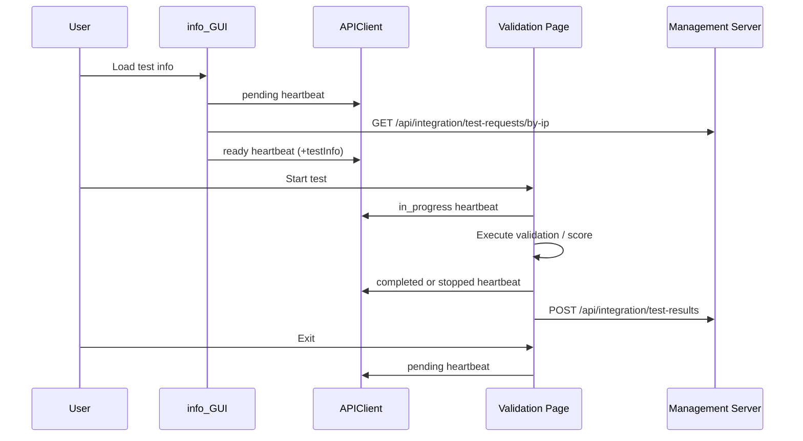

## Validation_tool
<p align="center">
   Banner" width="70%" />
</p>

<p align="center">
  <b>Validate and integrate physical security platforms and systems with a unified tool.</b>
</p>

<p align="center">
  <!-- Python 버전 -->
  
  
  <!-- Custom 기능 배지 -->
  
  
  
</p>


### Project
<p align="center">
  
</p>

- **GUI 기반 통합 검증 도구**
  시험 담당자가 복잡한 명령어 없이 화면에서 바로 검증을 수행할 수 있도록 설계된 통합 도구입니다.
  시험 설정, 실행, 모니터링, 결과 확인까지 하나의 UI 흐름으로 제공합니다.

- **관리 시스템 연동 자동화**
  시험 관리 시스템과 API로 연동되어 시험 정보 조회, 상태 동기화, 결과 리포팅을 자동 처리합니다.

- **통합시스템 및 단일시스템 시험 지원**
  하나의 프로젝트에서 통합시스템 시험과 단일시스템 시험을 모두 지원합니다.

- **실시간 검증 및 WebHook 시나리오 지원**
  일반 API 응답 검증뿐 아니라 WebHook 기반 시나리오까지 지원합니다.
  검증 결과는 단계별로 시각화되어 즉시 확인할 수 있습니다.

- **표준화된 상태 관리 (Heartbeat)**
  시험 생명주기 상태를 표준화하여 서버와 동기화합니다.

- **결과 데이터 구조화 및 자동 저장**
  시험 결과를 JSON 기반 구조로 생성하여 서버 전송 및 로컬 저장을 동시에 수행합니다.

---

### 실행 흐름


---

### 환경설정 — config.txt
```ini
[Management]
url=http://ect2.iptime.org:20223

[Test]
test_ip=192.168.1.100
```

| 항목 | 설명 |
|------|------|
| `url` | 관리시스템 주소 |
| `test_ip` | 시험 대상 IP (단일시스템 시험 시에만 사용) |

---

### 실행 방법

#### Onefile
1. `ValidationTool_onefile.exe` 와 `config.txt` 를 **같은 폴더**에 다운로드
2. `config.txt` 에서 관리시스템 URL 설정
3. exe 더블클릭 실행

#### Onedir
1. zip 파일 다운로드 후 압축 해제
2. 폴더 내 exe 실행 (`config.txt` 포함되어 있음)

---

### 빌드 방법

**환경**
- Python 3.9.13
- PyInstaller 5.13.2
- Windows 10

#### Onefile (config.txt 별도 배포)
```bash
pyinstaller --onefile --windowed --splash=assets/image/splash/splash.png \
  --name ValidationTool_onefile_Level1 \
  --add-data "assets;assets" --add-data "config;config" \
  --add-data "core;core" --add-data "spec;spec" --add-data "ui;ui" main.py
```

#### Onedir (config.txt 포함)
```bash
pyinstaller --onedir --windowed --splash=assets/image/splash/splash.png \
  --name ValidationTool_onedir_Level1 \
  --add-data "config.txt;." --add-data "assets;assets" --add-data "config;config" \
  --add-data "core;core" --add-data "spec;spec" --add-data "ui;ui" main.py
```

> Level 3 빌드 시: `--windowed` 제거 후 `--console` 추가, `config/CONSTANTS.py` 의 `DEBUG_LEVEL` 을 `3` 으로 변경

---

### 📋 릴리즈

최신 빌드 및 변경 사항은 [Releases](../../releases) 페이지를 참고하세요.
