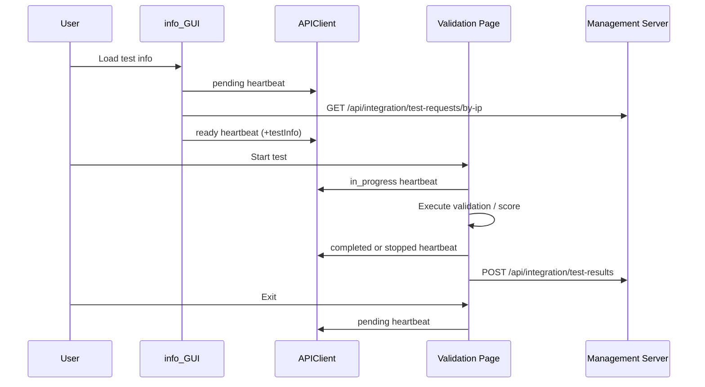

# Validation_tool
<p align="center">
   Banner" width="70%" />
</p>

<p align="center">
  <b>Validate and integrate physical security platforms and systems with a unified tool.</b>
</p>

<p align="center">
  <!-- Python 버전 -->
  
  
  <!-- Custom 기능 배지 -->
  
  
  
</p>


## Project 
<p align="center">
  
</p>

A unified validation tool for API integration testing of **integrated systems** and **standalone systems**.  
It retrieves test configurations from the management system and performs scenario-based API send/receive validation.
---

## Runtime Flow


---

## ⚙️ Configuration — config.txt
```ini
[Management]
url=http://ect2.iptime.org:20223

[Test]
test_ip=192.168.1.100
```

| Key | Description |
|-----|-------------|
| `url` | Management system address |
| `test_ip` | Target device IP (used for standalone system tests only) |

---

## 🚀 How to Run

### Onefile
1. Download `ValidationTool_onefile.exe` and `config.txt` into the **same folder**
2. Set the management system URL in `config.txt`
3. Double-click the exe to launch

### Onedir
1. Download and extract the zip file
2. Run the exe inside the extracted folder (`config.txt` is already included)

---

## 🔨 Build

**Environment**
- Python 3.9.13
- PyInstaller 5.13.2
- Windows 10

### Onefile (config.txt distributed separately)
```bash
pyinstaller --onefile --windowed --splash=assets/image/splash/splash.png \
  --name ValidationTool_onefile_Level1 \
  --add-data "assets;assets" --add-data "config;config" \
  --add-data "core;core" --add-data "spec;spec" --add-data "ui;ui" main.py
```

### Onedir (config.txt included)
```bash
pyinstaller --onedir --windowed --splash=assets/image/splash/splash.png \
  --name ValidationTool_onedir_Level1 \
  --add-data "config.txt;." --add-data "assets;assets" --add-data "config;config" \
  --add-data "core;core" --add-data "spec;spec" --add-data "ui;ui" main.py
```

> For Level 3 build: remove `--windowed`, add `--console`, and set `DEBUG_LEVEL = 3` in `config/CONSTANTS.py`

---

## 📋 Releases

See the [Releases](../../releases) page for the latest builds and changelogs.
브랜치 설명은 한국어로 되어 있는 이름(정수인, 장예진)이 있어서 뺐어요. 필요하면 다시 넣어드
