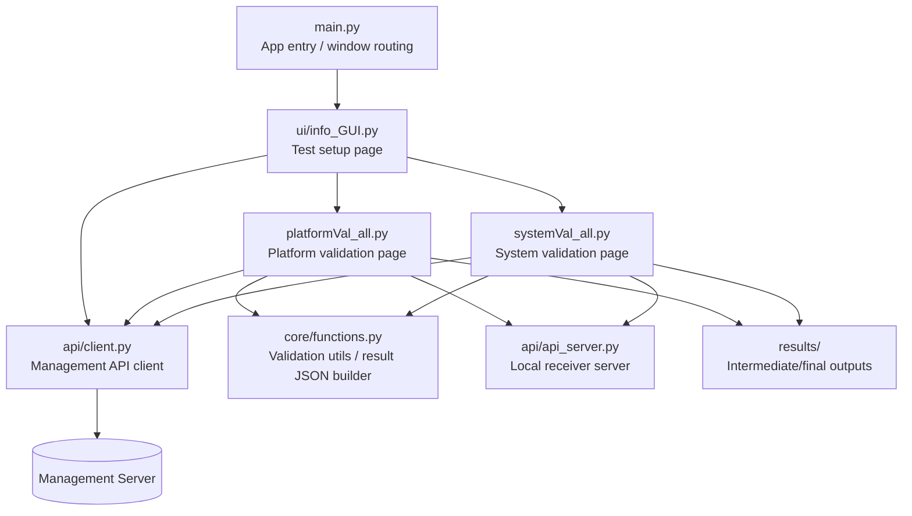
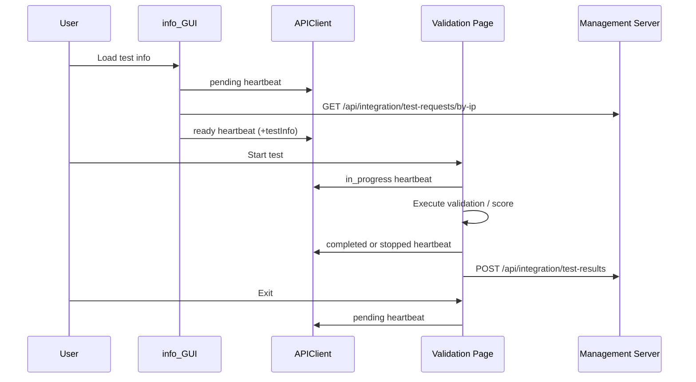

# Validation_tool

   Banner" width="70%" />

  <b>Validate and integrate physical security platforms and systems with a unified tool.</b>

  <!-- Python 버전 -->
  
  
  <!-- Custom 기능 배지 -->
  
  
  

## Project 

  

## Architecture

## Runtime Flow

