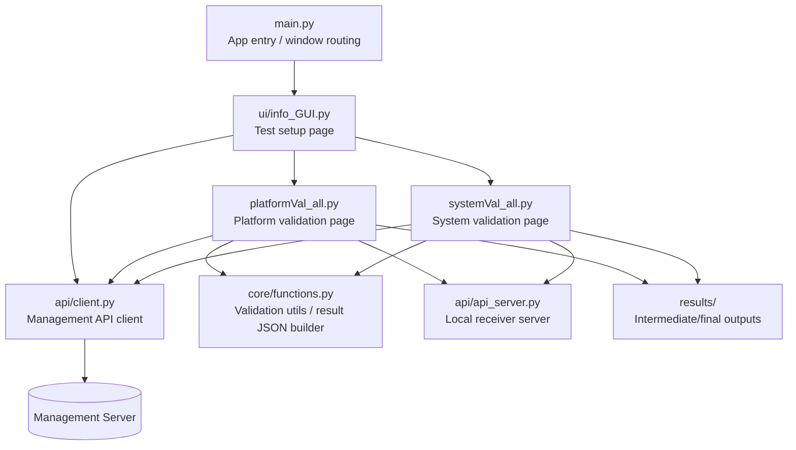
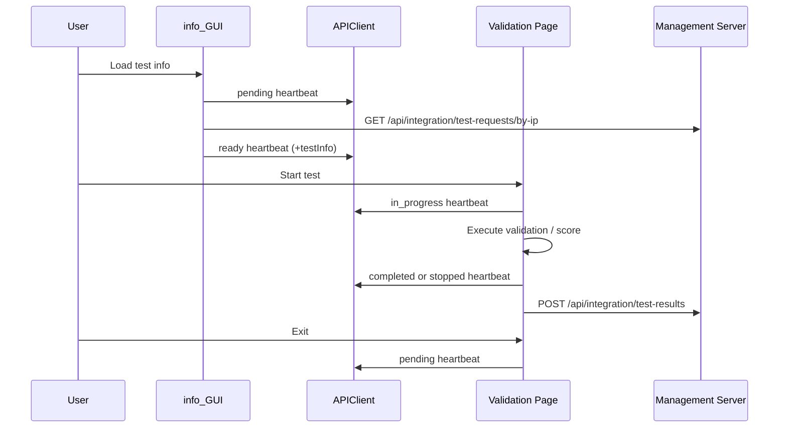

# Validation_tool
<p align="center">
   Banner" width="70%" />
</p>

<p align="center">
  <b>Validate and integrate physical security platforms and systems with a unified tool.</b>
</p>

<p align="center">
  <!-- Python 버전 -->
  
  
  <!-- Custom 기능 배지 -->
  
  
  
</p>


## Project 
<p align="center">
  
</p>

### GUI 기반 통합 검증 도구
시험 담당자가 복잡한 명령어 없이 화면에서 바로 검증을 수행할 수 있도록 설계된 통합 도구입니다.  
시험 설정, 실행, 모니터링, 결과 확인까지 하나의 UI 흐름으로 제공합니다.

### 관리 시스템 연동 자동화
시험 관리 시스템과 API로 연동되어 시험 정보 조회, 상태 동기화, 결과 리포팅을 자동 처리합니다.  
수동 보고 절차를 줄이고 운영 일관성을 높일 수 있습니다.

### 플랫폼/시스템 시험 통합 운영
하나의 프로젝트에서 플랫폼 시험과 시스템 시험을 모두 지원합니다.  
공통 기능은 재사용하고, 시험 유형별 로직은 분리해 유지보수성과 확장성을 확보했습니다.

### 실시간 검증 + WebHook 시나리오 지원
일반 API 응답 검증뿐 아니라 WebHook 기반 시나리오까지 포함해 실제 운영 환경에 가까운 검증이 가능합니다.  
검증 결과는 단계별로 시각화되어 즉시 확인할 수 있습니다.

### 표준화된 상태 관리 (Heartbeat)
시험 생명주기 상태를 표준화해 서버와 동기화합니다.  
대기, 준비, 진행, 완료, 중단, 오류 상태를 일관된 규격으로 전송해 관제/운영 추적이 용이합니다.

### 결과 데이터 구조화 및 자동 저장
시험 결과를 JSON 기반 구조로 생성해 서버 전송 및 로컬 저장을 동시에 수행합니다.  
점수, 필드 검증, 오류 내역, 시도 이력 등을 포함해 사후 분석과 이력 관리에 적합합니다.

### 운영 안정성을 고려한 설계
일정 검증, 예외 처리, 상태 가드, 일시정지/재개 흐름을 포함해 실제 시험 운영 중 발생 가능한 상황을 안정적으로 처리하도록 구성했습니다.

## Architecture


```mermaid
flowchart TD
    A[main.py\nApp entry / window routing] --> B[ui/info_GUI.py\nTest setup page]
    B --> C[platformVal_all.py\nPlatform validation page]
    B --> D[systemVal_all.py\nSystem validation page]

    B --> E[api/client.py\nManagement API client]
    C --> E
    D --> E

    C --> F[core/functions.py\nValidation utils / result JSON builder]
    D --> F

    C --> G[api/api_server.py\nLocal receiver server]
    D --> G

    C --> H[results/\nIntermediate/final outputs]
    D --> H

    E --> I[(Management Server)]
```

## Directory Tree (Core)

```text
Validation_tool2/
|- main.py
|- platformVal_all.py
|- systemVal_all.py
|- form_validator.py
|- api/
|  |- client.py
|  |- api_server.py
|  `- webhook_api.py
|- core/
|  |- functions.py
|  `- logger.py
|- ui/
|  |- info_GUI.py
|  |- platform_main_ui.py
|  |- system_main_ui.py
|  |- result_page.py
|  `- widgets.py
|- config/
|  `- CONSTANTS.py
|- assets/
|- results/
|- tests/
`- docs/
```

## Runtime Flow


```mermaid
sequenceDiagram
    participant U as User
    participant I as info_GUI
    participant A as APIClient
    participant V as Validation Page
    participant S as Management Server

    U->>I: Load test info
    I->>A: pending heartbeat
    I->>S: GET /api/integration/test-requests/by-ip
    I->>A: ready heartbeat (+testInfo)

    U->>V: Start test
    V->>A: in_progress heartbeat
    V->>V: Execute validation / score
    V->>A: completed or stopped heartbeat
    V->>S: POST /api/integration/test-results

    U->>V: Exit
    V->>A: pending heartbeat
```

## Branch
runner: 시험 진행 GUI (정수인)

info: 시험 정보 GUI (장예진)
